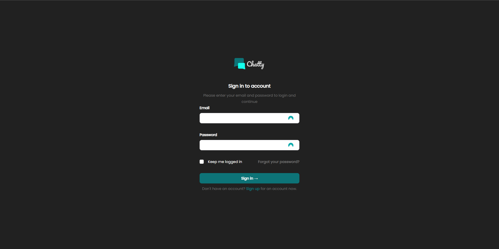
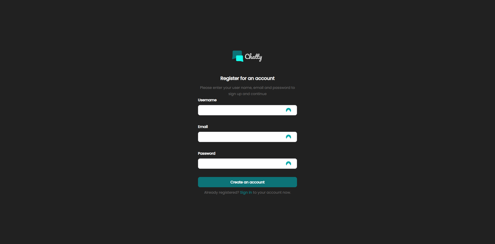
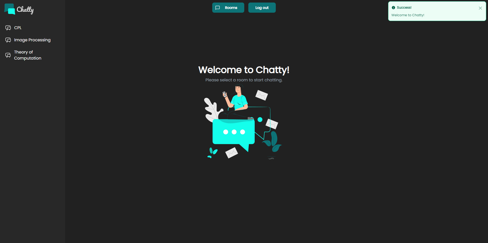
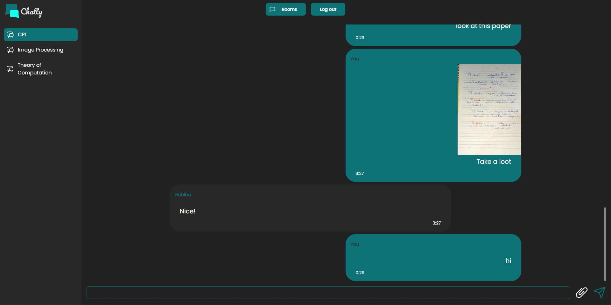

# Chatty

A Phoenix LiveView application that uses LiveStream to implement a real-time chatting feature.

# Features

- Authentication and encryption using Bcrypt
- Real-time Messaging using Streams
- Real-time file sharing
- Implemented `Rooms` for each group chat
- Used the `~H"""` Component Segel to build the front-end 

# Screen-Shots

## Getting Started

To start your Phoenix server:

* Install dependencies with `mix deps.get`
* Change the DB name and pass in `config/dev.exs`
* Create and migrate your database with `mix ecto.setup` and `mix ecto.migrate`
* Start Phoenix endpoint with `mix phx.server` or inside IEx with `iex -S mix phx.server`

Now you can visit [`localhost:4000`](http://localhost:4000) from your browser.
